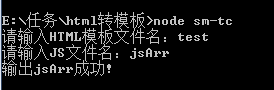

sm-tc.js
-----------------------------------------

>sm-template-convert author:xingmling.wang@shenma-inc.com


很多同学喜欢讲模板写在JS里面便于缓存，
HTML模板弄到JS有两种方式：

 1.字符串
 2.数组


数组的可维护行好，一般都会使用,但手动吧HTML转为数组很痛苦

所以我写了个插件sm-tc,就是把html转为js数组的

 使用方法：
```shell
node sm-tc
输入要转的html文件名(不写.html)
输入要生成的js文件名(不写.js)
输出完成
```


html模板：
```html
<div class="sc-page sc-panel" data-log="" data-panel="#content" data-panel-dismiss="">
    <div class="page-topbar">
        <a href="javascript:;" class="page-btn page-back" data-panel-close="" data-sps=""></a>
        <p class="page-title">中间页标题</p>
        <a href="javascript:;" class="page-btn page-search"></a>
    </div>
    <div class="page-content">
        <ul class="sc-tab" data-tab="">
            <li class="current" data-sps="">全部</li>
            <li data-sps="">专业评测</li>
            <li data-sps="">提车作业</li>
            <li data-sps="">导购</li>
            <li data-sps="">试驾</li>
        </ul>
        <div class="sc-tab-page show">
             <div class="article-list">
                <a href="#" class="article">
                    </img>
                    <div class="article-abstract">
                        <p class="article-title">2014款奥迪A8 豪华版12014款奥迪A8 豪华版12014款奥迪A8 豪华版12014款奥迪A8 豪华版1</p>
                        <span class="article-form">宝马论坛-汽车之家</span>
                        <span class="article-date right">2015-1-7</span>
                    </div>
                </a>
                <a href="#" class="article">
                    </img>
                    <div class="article-abstract">
                        <p class="article-title">2014款奥迪A8 豪华版1</p>
                        <span class="article-form">宝马论坛-汽车之家</span>
                        <span class="article-date right">2015-1-7</span>
                    </div>
                </a>
                <a href="#" class="article">
                    </img>
                    <div href="#" class="article-abstract">
                        <p class="article-title">2014款奥迪A8 豪华版1</p>
                        <span class="article-form">宝马论坛-汽车之家</span>
                        <span class="article-date right">2015-1-7</span>
                    </div>
                </a>
        </div>   
        </div>
        <div class="sc-tab-page">
                <a href="javascript:;">专业评测</a>
        </div>
        <div class="sc-tab-page">
                <a href="javascript:;">提车作业</a>
        </div>
        <div class="sc-tab-page">
                <a href="javascript:;">导购</a>
        </div>
        <div class="sc-tab-page">
                <a href="javascript:;">试驾</a>
        </div>
    </div>
</div>
```


输出js数组内容

```javascript
'<div class="sc-page sc-panel" data-log="" data-panel="#content" data-panel-dismiss="">',
'        <div class="page-topbar">',
'            <a href="javascript:;" class="page-btn page-back" data-panel-close="" data-sps=""></a>',
'            <p class="page-title">中间页标题</p>',
'            <a href="javascript:;" class="page-btn page-search"></a>',
'        </div>',
'        <div class="page-content">',
'            <ul class="sc-tab" data-tab="">',
'                <li class="current" data-sps="">全部</li>',
'                <li data-sps="">专业评测</li>',
'                <li data-sps="">提车作业</li>',
'                <li data-sps="">导购</li>',
'                <li data-sps="">试驾</li>',
'            </ul>',
'            <div class="sc-tab-page show">',
'                 <div class="article-list">',
'                    <a href="#" class="article">',
'                        </img>',
'                        <div class="article-abstract">',
'                            <p class="article-title">2014款奥迪A8 豪华版12014款奥迪A8 豪华版12014款奥迪A8 豪华版12014款奥迪A8 豪华版1</p>',
'                            <span class="article-form">宝马论坛-汽车之家</span>',
'                            <span class="article-date right">2015-1-7</span>',
'                        </div>',
'                    </a>',
'                    <a href="#" class="article">',
'                        </img>',
'                        <div class="article-abstract">',
'                            <p class="article-title">2014款奥迪A8 豪华版1</p>',
'                            <span class="article-form">宝马论坛-汽车之家</span>',
'                            <span class="article-date right">2015-1-7</span>',
'                        </div>',
'                    </a>',
'                    <a href="#" class="article">',
'                        </img>',
'                        <div href="#" class="article-abstract">',
'                            <p class="article-title">2014款奥迪A8 豪华版1</p>',
'                            <span class="article-form">宝马论坛-汽车之家</span>',
'                            <span class="article-date right">2015-1-7</span>',
'                        </div>',
'                    </a>',
'            </div>   ',
'            </div>',
'            <div class="sc-tab-page">',
'                    <a href="javascript:;">专业评测</a>',
'            </div>',
'            <div class="sc-tab-page">',
'                    <a href="javascript:;">提车作业</a>',
'            </div>',
'            <div class="sc-tab-page">',
'                    <a href="javascript:;">导购</a>',
'            </div>',
'            <div class="sc-tab-page">',
'                    <a href="javascript:;">试驾</a>',
'            </div>',
'        </div>',
'    </div>'
```

`注意事项`：需依赖prompt.js，已在git同目录下